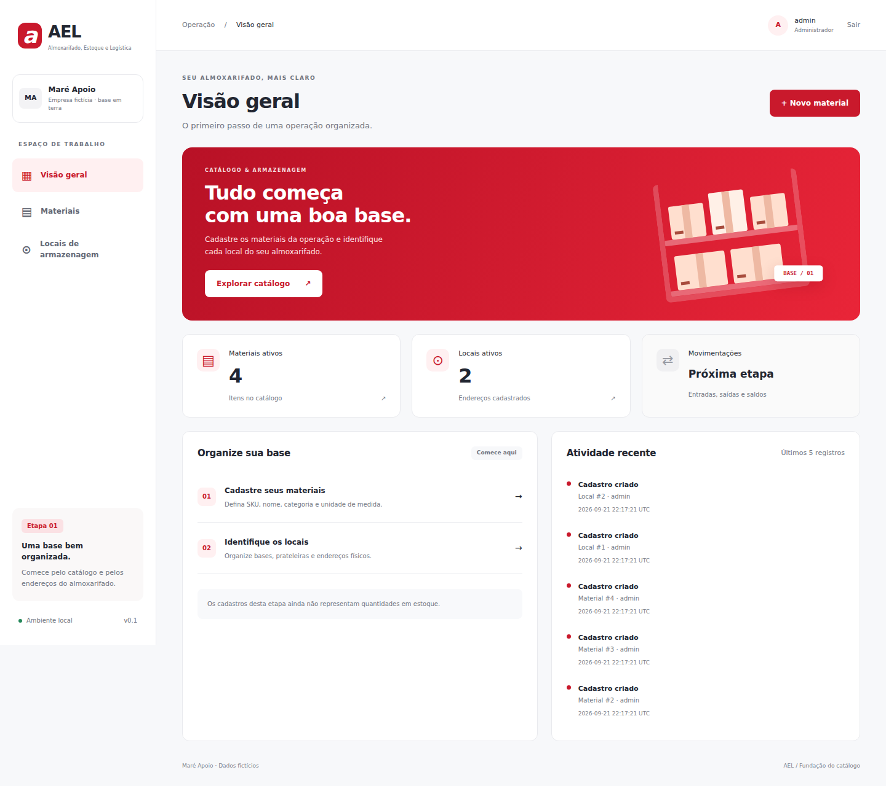

# AEL — Almoxarifado, Estoque e Logística

[](https://github.com/HystenHop/ael/actions/workflows/ci.yml)


Aplicação web para organizar materiais e endereços de armazenagem de pequenas
operações. A primeira versão estabelece um catálogo confiável antes da entrada de
saldos e movimentações.



## O problema

Materiais registrados com nomes diferentes em planilhas e mensagens geram
dúvidas sobre a identidade do item e seu local de armazenagem. O AEL começa pela
base: cada material possui um código único e cada local possui um endereço claro.

O cenário de referência é a **Maré Apoio**, empresa fictícia de pequeno porte com
almoxarifado em terra. Esse recorte orienta a demonstração, mas não representa
validação com uma empresa real nem certificação para operações offshore.

## O que a v0.1 entrega

- autenticação de administrador com senha armazenada por hash;
- cadastro, edição, pesquisa, desativação e reativação de materiais e locais;
- SKU e códigos únicos, validados no servidor e no banco;
- categorias e unidades de medida controladas;
- histórico com responsável e valores anteriores e posteriores;
- alteração e auditoria confirmadas na mesma transação;
- controle de versão contra sobrescrita por formulário desatualizado;
- migrações SQL versionadas;
- proteção CSRF, sessão segura e permissão verificada em cada operação;
- interface responsiva para desktop e celular;
- testes automatizados e integração contínua no GitHub Actions.

## Tecnologias

Python 3.11+, Flask 3.1, SQLite, Jinja, HTML, CSS, JavaScript, pytest, Ruff e
GitHub Actions.

## Arquitetura

O projeto começa como um monólito modular:

| Componente | Responsabilidade |
|---|---|
| `ael/__init__.py` | Configuração da aplicação, sessão, CSRF e cabeçalhos |
| `ael/auth.py` | Login, logout e autorização |
| `ael/catalog.py` | Rotas HTTP e renderização das telas |
| `ael/services.py` | Validação, regras de cadastro e auditoria |
| `ael/db.py` | Conexão SQLite, migrações e comandos administrativos |
| `ael/migrations/` | Evolução versionada do esquema |
| `ael/templates/` | Templates renderizados no servidor |
| `tests/` | Testes de regras, permissões e integridade |

Documentação técnica:

- [Escopo e critérios de aceite](docs/ESCOPO.md)
- [Decisões da v0.1](docs/DECISOES.md)
- [Fluxo da aplicação](docs/ARQUITETURA.md)
- [Validação executada](docs/VALIDACAO.md)

## Executando localmente

```powershell
py -m venv .venv
.\.venv\Scripts\python.exe -m pip install -r requirements-dev.txt
.\.venv\Scripts\python.exe -m flask --app ael init-db
.\.venv\Scripts\python.exe -m flask --app ael create-admin --username admin
.\.venv\Scripts\python.exe .\run.py
```

A aplicação ficará disponível em
[http://127.0.0.1:5000](http://127.0.0.1:5000). Dados fictícios opcionais podem ser
incluídos com `flask --app ael seed-demo --username admin` usando o Python da
`.venv`.

## Qualidade

```powershell
.\.venv\Scripts\python.exe -m pytest -q
.\.venv\Scripts\python.exe -m ruff check .
.\.venv\Scripts\python.exe -m ruff format --check .
```

A suíte atual possui 44 testes para autenticação, permissões, CSRF, validações,
integridade transacional, auditoria, concorrência otimista, migrações e comandos
administrativos.

## Limitações da primeira versão

A v0.1 ainda não registra quantidades, entradas, saídas, reservas, transferências
ou inventário. Os perfis de almoxarife, solicitante e aprovador estão previstos
no esquema, mas ainda não possuem fluxos funcionais.

A execução atual é local. Recuperação de senha, limite de tentativas de login,
backup, monitoramento, paginação e implantação permanecem fora deste recorte.

## Próximas etapas

1. Entradas, saídas, saldo físico e bloqueio de saldo inválido.
2. Solicitações, aprovação, reserva e cancelamento.
3. Separação, expedição, transferência, trânsito e recebimento.
4. Reconciliação, backup, auditoria consultável e refinamento da interface.

## Transparência

A IA participou do planejamento, da implementação, dos testes e da documentação.
As decisões e limitações relevantes permanecem registradas para que a evolução do
projeto seja verificável.

## Licença

Distribuído sob a [licença MIT](LICENSE).
